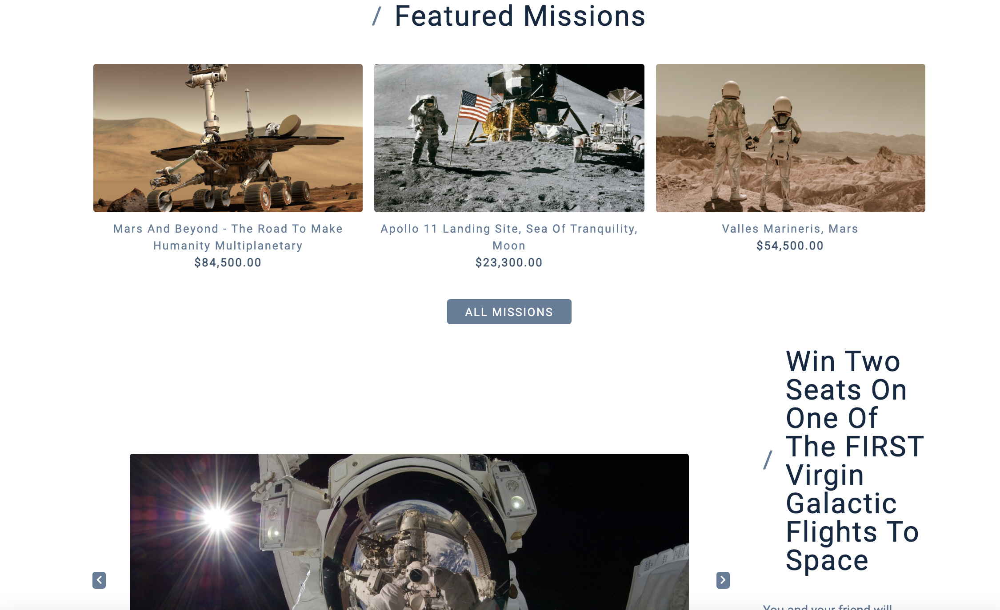
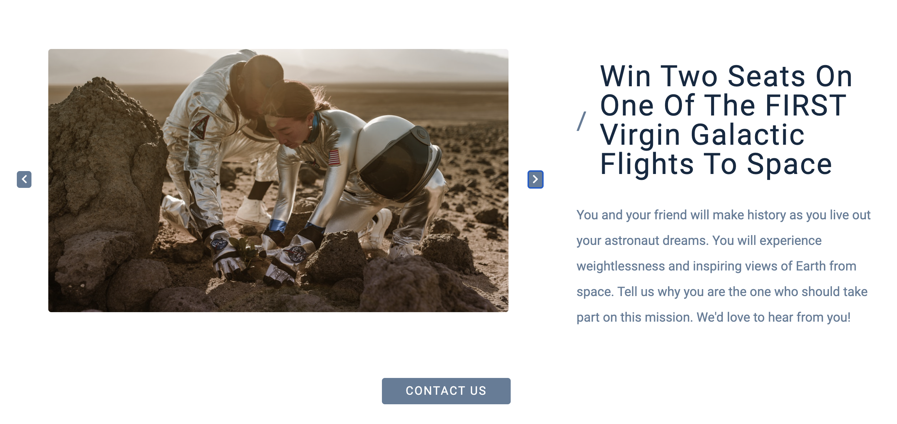
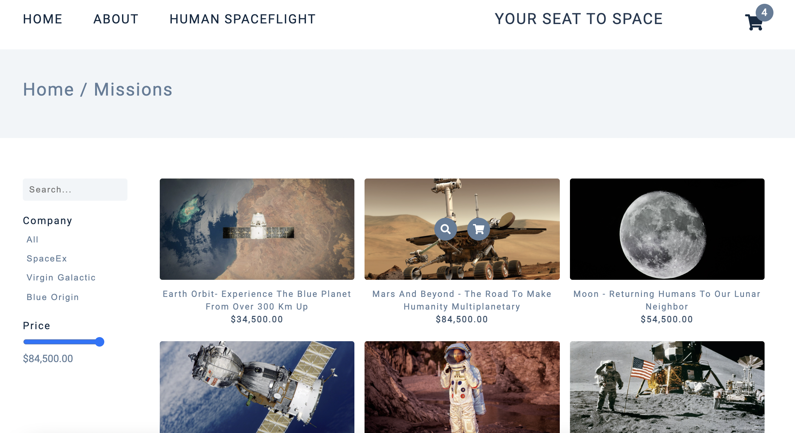
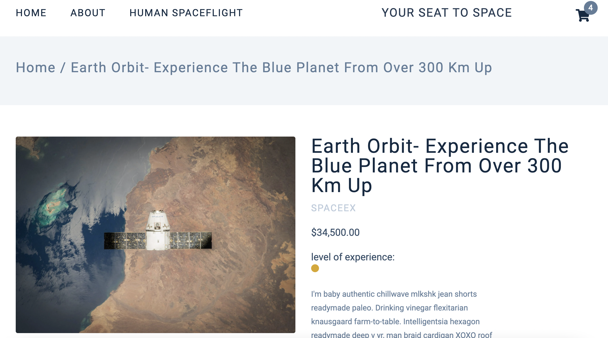
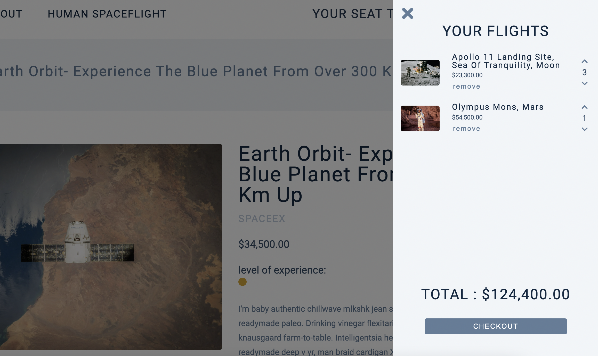

## Vanilla JS Project - Space Travel Company Website - Your Seat To Space

- See the project on Netlify
- Inspiration from John Smilga Vanilla JS project Comfy
- Responsive CSS design: On a small screen we have a sidebar.
- Fetching the data from mock json-server.
- Saving the data in the local storage, so we don't need to fetch it more than once and have it available on all project pages.
- Navbar with logo and links, that navigate to separate pages. Shopping cart.
- On the home page, we have: Hero with link to all flights; Section with featured flights. When we hover over a featured flight, we have link to a single-flight-page and add-to-cart link; Win-a-flight section with an images slider.
- Single-flight-page: image and info about the flight as well as the option to add the flight to the cart. When we click on a certain flight, we take its id, include it in the product url and use it to fetch detailed info about the flight.
- All-flights-page: filter functionality based on company or price; search form for searching for a flight by name.
- Simple about page
- Shopping cart: Once the product is in the cart we can change its amount or remove it from the cart. Shopping cart items are saved in locale storage and user's flight choices can be seen every time user visit the page.
- Using Intl.NumberFormat() to format the prices
- Using json-server for mock Api. JSON Server is a Node Module that
  you can use to create demo rest json webservice.
  [getting started with json-server](https://www.npmjs.com/package/json-server#getting-started)
  - local install: npm i json-server
  - create db.json file with some data
  - npx json-server --watch db.json

    

  

    

  

    

  

    

  

    

  

    

  
